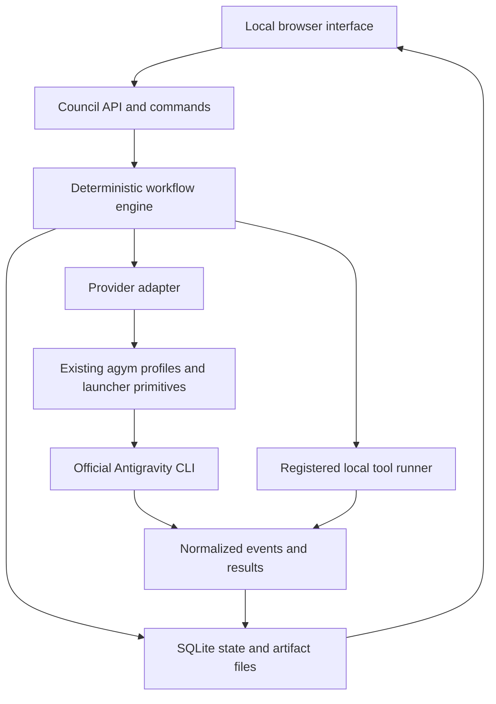

# AGYM Council product and engineering blueprint

Date: 2026-09-21. Status: proposed design for implementation by another LLM. This package is not a working council application. Examples and limits are design defaults, not measured optimal values. Specialized use cases belong in optional workflow presets, not application dependencies.

## Product decision

Extend the existing `Tiago-0liveira/agy-manager` repository into a local application for assembling AI teams and running reusable workflows. Keep the existing account/profile launcher usable on its own. Add a council layer above it, with a local browser interface and a separate command entry point.

Working name: AGYM Council. The user can add any number of account profiles, give them friendly names, choose a subset for a run, assign reusable roles and individual tasks, choose models available to those accounts, control parallelism and iteration budgets, and observe/pause/resume the work. There is no product-level hard cap of four accounts or workers. Actual simultaneous work is bounded by configured limits, machine resources and provider availability.

The application is a workflow runner whose participants can be AI agents, a human or a registered local tool. It supports short advice sessions and longer investigations. Its output may be a decision, critique, report, plan or local artifact. It must not require all tasks to become debates or force all workflows to produce consensus.

## The essential separation

| Object | Meaning | Example |
|---|---|---|
| Account | Access through a provider/profile, with friendly label and availability | Personal, Work, Research 2 |
| Agent template | Reusable role, working style, responsibilities and output expectations | Critical reviewer, researcher, writer |
| Worker | One run's instance of an agent, bound to an account/model/task and workspace | Reviewer 1 using Research 2 |
| Workflow template | Stages, participant groups, information sharing, outputs and limits | Independent opinions then critique then synthesis |
| Run | An immutable, fully resolved execution of a goal, inputs, team and workflow | Review the proposed product launch |
| Conversation | A provider-specific context handle for one worker within a run | A saved Antigravity conversation ID |
| Artifact | A versioned input or output, with origin and visibility rules | Source document, review, final report |

Account labels and worker names are independent. A role is not permanently embedded in a Google account. The UI may offer a default role for convenience, but changing that default affects future runs only. Multiple workers may use the same account with separate conversations; the scheduler applies the account's concurrency limit. Multiple accounts can use the same role. Account count, worker count and parallel-process count are different controls.

Represent 'personality' as useful working instructions: tone, focus, critique style, depth, evidence expectations and output format. Avoid artificial confidence or claims that a persona creates expertise. A role prompt cannot grant tools, bypass a data restriction, increase a budget or overrule the user's objective.

## User experience

### Accounts

Show account cards with friendly name, profile reference, provider, discovered models, last verified authentication, usage freshness and current activity. Provide Add account, Connect/Reconnect, Rename label, Disable, Check status and Remove. Large lists support search and filtering. A cached credential file alone does not mean authentication is working; use states such as unverified, ready, needs login, unavailable and unknown.

Adding an account uses the existing `agym` profile logic and the provider's normal sign-in. Initially offer 'Open sign-in terminal' plus 'Check connection'; do not build an embedded password form or a second OAuth implementation. The visible interactive helper is opened only in response to the user's Connect action. A local web page cannot itself provide a native terminal, so a small desktop-side auth broker must launch the helper and report completion. Until that helper exists, guide the user through `agym setup` without pretending browser-only login is implemented.

Allow friendly renaming without moving the profile's credential directory. Disable or remove cannot silently invalidate running tasks; show affected runs and require them to stop or finish first. Removing a council label is distinct from deleting a profile. Do not replicate tokens into the council database, exports or logs. Keep account mappings local when sharing workflow templates.

### Agents and roles

Provide a role library, custom role editor and per-run override. Each template contains a name, purpose, prompt, optional preferred model, output contract and suggested capabilities. Display the effective capabilities separately from the role text. Example templates: investigator, planner, constructive critic, implementer, editor, coordinator and external reviewer. Users may create neutral or creative roles as well as technical ones.

### Workflows

Start with a guided stage editor, not a complex drag-and-drop programming canvas. Users choose a preset, add/remove worker slots, choose who participates in each stage, set how prior outputs are shared, and specify completion/review rules. An advanced JSON view supports export/import. Configuration is data, not executable Python or arbitrary shell snippets.

Initial presets: Quick council; Review and revise; Compare alternatives; Research and design. A later Build and verify preset adds scoped code execution and isolated workspaces. Domain-specific presets are ordinary saved configurations plus evidence packs, not engine code.

### New run

Enter the goal and desired deliverable; attach inputs or choose a workspace; select a workflow; choose team size and account bindings; customize roles/tasks/models; set limits and permissions; inspect the resolved plan; start. Show account usage as advisory and timestamped. Unknown subscription cost is not displayed as zero. A planning assistant may suggest a workflow, but the user-visible resolved plan is what gets executed.

Adding/removing a worker updates stage assignments through a guided validator. Do not let the UI create dangling references or silently drop a required reviewer. Runtime edits become versioned run amendments or a child run, not mutations of completed history. A user can stop, clarify or redirect work, with the change recorded and delivered at defined turn boundaries.

### Live run and results

Use a stage timeline, worker cards, event/activity stream, artifacts, open issues and resource counters. Each worker shows its role, account label, model, current assignment and status. Do not label generated commentary or elapsed time as proof of deep reasoning. Display provider-supplied progress where available; never fabricate private reasoning traces.

Pause stops new dispatch after in-flight work reaches a checkpoint. Stop actively cancels processes. Resume continues from verified state. Partial results remain inspectable. The final page distinguishes completed, completed with declared limitations, needs attention, budget exhausted, cancelled and failed. 'All stages finished' is an operational status, not a statement that the answer is correct.

## Software architecture

Recommended first stack: retain Python >=3.10 compatibility for `agym`; add an optional Python council backend with FastAPI, Pydantic and SQLite, plus React/TypeScript/Vite for the local UI. These are proposed implementation choices, not existing repository features. Do not add Redis, a distributed queue, Kubernetes, cloud accounts or an agent framework in the first release.



The engine chooses eligible tasks, enforces stage barriers and limits, saves state and validates outputs. Agents investigate, write, critique and propose actions. A coordinator agent may propose the next permitted action, but it cannot rewrite the engine or secretly open a new stage.

A single scheduler process owns a local database lock. API handlers enqueue requests; they do not create independent untracked schedulers. Browser refreshes and reconnects do not restart tasks. SQLite transactions claim work and reserve capacity. An append-only event sequence supports replay of the UI and inspection; it is not claimed to be a tamper-proof audit system.

## Build on the actual agy-manager repository

Reviewed commit: `76bfbb562677ce74b37040bf8c03a205cd0456d6`. Reinspect HEAD before implementation because this is an actively changing project.

Reuse `agym/profiles.py` for profile metadata and directory conventions; `launcher.py` for resolving the real executable, constructing the per-profile environment and argument handling; `usage.py` for advisory availability; `diagnostics.py` for installation/profile checks; and existing profile/host-safety tests. Keep `subscription.py` and existing CLI behavior working. Do not use the two-stage auto-prompt feature as the workflow engine: its plan-then-interactive behavior is a different product feature.

Create a separate entry point, `agym-council`, initially. The current CLI treats unknown first arguments as profile names, and `council` can already be a valid profile name. Adding `agym council` without migration could shadow an existing account. A later alias must handle that conflict explicitly.

Keep base install lightweight through an optional `council` dependency extra. The current setuptools configuration lists only the `agym` package; switch to deliberate package discovery when adding subpackages and include built frontend assets. Test the installed wheel, not only imports from a checkout.

Suggested repository structure; filenames are architectural targets, not a requirement to create empty abstractions:

```text
agym/                         existing launcher remains
  profiles.py
  launcher.py
  usage.py
  diagnostics.py
  council/
    cli.py                    new entry point
    models.py                 validated immutable configuration/result contracts
    accounts.py               profile references, labels and auth broker
    roles.py                  reusable roles and effective prompt construction
    workflows.py              preset expansion and semantic validation
    engine.py                 stages, barriers and bounded review cycles
    scheduler.py              leases, capacity, pause and recovery
    storage.py                SQLite transactions and migrations
    artifacts.py              content hashes, versions, access manifests
    policies.py               effective capabilities and approved job rules
    context.py                per-worker inputs, release and checkpoint manifests
    providers/
      base.py                 transport-neutral capability interface
      antigravity.py          agym profile plus headless CLI
      fake.py                 deterministic development/test provider
    jobs.py                   later registered local job execution
    api.py                    local API and server-sent events
    presets/                  versioned workflow/role resources
    web_dist/                 packaged production UI assets
web/                          React/TypeScript sources
tests/council/                new tests, keep old tests intact
docs/council/                 user guide and protocol compatibility notes
```

Use the existing account launch primitives through a narrow internal service, with explicit cwd and child environment. Do not mutate process-wide environment variables while launching concurrent profiles. Existing profile JSON writes are atomic replacements but whole-file read/modify/write operations still need a cross-process lock before concurrent account mutations are supported. That lock must cover the CLI and council, not just the web API.

## Workflow behavior

The initial execution format is a bounded sequence of stages. A stage can dispatch one or many independent worker turns. Each stage specifies participating workers, released prior-stage inputs, an instruction, an output contract and a completion policy. Stages run in order; workers within a stage run concurrently subject to resource limits. Outputs are sealed until all required workers finish. This covers useful councils without first building an unrestricted graph language.

Provide these patterns using the same primitives:

| Pattern | Behavior |
|---|---|
| Parallel consultation | Independent answers, followed by explicit synthesis |
| Sequential collaboration | Output of one stage is input to the next |
| Critique and revision | Reviewer objections feed a bounded revision stage |
| Competing designs | Independent drafts, shared comparisons, preserved differences |
| Project execution | Scoped implementation jobs plus separate verification |
| Human checkpoint | Stop at a defined decision rather than invent consent |

MVP iterations are explicit finite stages. The next increment adds a bounded review/revise block with a numeric maximum and a predefined completion rubric. No unbounded 'while the model thinks more work is useful' loop. General DAG editing, dynamic agent spawning and arbitrary delegation are later features, if real use demonstrates the need.

Workers keep their own conversation throughout a run; initial contexts are fresh unless the user deliberately forks an earlier run. Private context is not copied just because another worker uses the same account. Artifact sharing is controlled by the stage input manifest, not by dumping all conversation history into every prompt. A private-stage barrier also requires isolated artifact access: hiding a UI tab is insufficient if peers can read the same output folder with file tools.

Roles persist unless a workflow explicitly changes them. The default council does not rotate them. Peer criticism must cite concrete claims or artifacts. Anonymous comparison is optional; source identities remain in provenance. Agreement, majority voting and model confidence can be displayed as opinions, never universal correctness gates. Creative brainstorming and evidence-heavy research may use different completion rubrics.

The final synthesizer receives all relevant accepted submissions plus unresolved disagreements. It must not quietly turn disagreement into consensus. A workflow can end with alternatives or no recommendation. Every stage has required output structure; valid JSON proves structure only, not truth.

## Provider and account integration

The first provider is the official Antigravity CLI through your existing isolated profiles. Do not reimplement its OAuth, parse secret token files or build an account rotation service. Manual profile assignment is explicit; if an account is exhausted, pause/wait for it or request an explicit reassignment. A reassignment creates a recorded binding change and a fresh provider conversation if required. Conversations are not assumed portable between accounts.

Account isolation using redirected home and forced file storage is an existing project workaround, not a verified guarantee for every CLI release. Run the repository's real-login isolation procedure on Windows and record the installed version before relying on concurrency. Profile credential isolation is not filesystem isolation for tools launched by the agent.

The official headless interface documents structured output, conversation IDs and explicit resumption. Use a saved ID for every worker; do not use 'latest conversation' under concurrency. Start with one process per turn; keep provider conversation continuity across turns. Streaming continuous processes are an optional optimization later. Probe version/capabilities, pin discovered model identifiers and retain raw output for parser troubleshooting. Unsupported features cause a clear needs-attention state, not a silent model/policy fallback. [Antigravity headless documentation](https://www.antigravity.google/docs/cli/headless/)

Long prompts should travel through documented stdin input after a compatibility check, rather than growing Windows command lines. Parse both process status and the protocol terminal result. A required tool can be denied even though the CLI exits successfully; verify the required artifact/job evidence separately. Provider-event parsing belongs in the adapter, not the UI or generic workflow engine.

Future adapters can wrap another CLI or an API, including an external auditor. Introduce a capabilities map now: structured output, resume, cancellation, tools, usage, model discovery and enforceable access restrictions. Do not promise all providers have identical features. Do not ship a generic shell-command provider that allows imported workflows to run arbitrary commands.

## Storage and recovery

Use existing agym profile storage as the authoritative credential-profile source. Council SQLite stores metadata references, not credential copies. Tables should cover account labels/references, agent templates, workflow versions, runs, workers, stage instances, attempts, artifacts, issues, jobs and events. Roles/workflows/runs carry schema versions. At run start snapshot prompts, model choices, permissions, budgets, input hashes and expanded stages; changes to library templates do not mutate a running study.

Store large text/artifacts in an application-controlled run directory with IDs, versions, hashes and relative paths in SQLite. Do not allow arbitrary user-supplied filesystem paths through download endpoints. Imported filenames, symlinks and Windows junctions require canonical-path checks. Exports include instructions, results, provenance and dissent, excluding authentication state and local account mappings by default.

Maintain per-account and global concurrency limits. Default to one active request per account until concurrency has been tested, while allowing configurable parallelism across accounts. A large team can queue; it need not be capped to the number of live processes. Usage collection is advisory, throttled and included in capacity management so monitoring does not interfere with active work.

Each attempt has a stable identity, input digest, process record, captured output location and state. Save dispatch intent before starting a process. After restart, reconcile in-flight attempts before retrying. A call may have executed or incurred usage even if its response was lost. Do not claim exactly-once external execution. Side-effecting jobs with unknown completion require reconciliation or attention; do not blindly rerun them. Pure reasoning retries still get their own attempt record and budget accounting.

Cancellation must terminate the process tree on Windows as well as POSIX. Pause has different semantics: stop dispatching new tasks and wait for in-flight turns unless the user chooses immediate interruption. Closing the browser does not pause the backend. Stopping the backend must leave recoverable records and no untracked job children.

Bound model-call count, wall time, retries and local jobs. Token limits are enforced where the provider exposes reliable usage; missing measurements are unknown, not zero. Reserve capacity for in-flight calls or document their maximum overrun. Paid API cost can be metered with explicit pricing; subscription quota is not a reliable per-run dollar amount. Mandatory missing workers prevent required-stage completion rather than silently disappearing from the council.

## Tools and workspace scope

Start with discussion over supplied files/text. Add workspace work as a distinct capability tier. A role's request for access must be checked against the run policy. A staged worker folder alone is not a security sandbox. Advertise restricted access only when the provider/OS runner demonstrably enforces it; otherwise disclose unconfined execution and block workflows requiring protected-data guarantees.

For code tasks, prefer isolated checkouts or copies and explicit ownership. Reviewers can be read-only. Record diffs and test output. A local artifact-editing scope does not imply authorization to publish, deploy, send messages or alter external systems. The user can preauthorize a well-defined action policy at launch; do not add repetitive permission dialogs inside that already approved scope.

Registered tool jobs are reusable names mapped to fixed executables/argument schemas and declared resource access. Agents request a job by name and validated parameters. Imported workflow files cannot define executable strings. Researchers may propose new analysis code in scratch space; executing it is a separately recorded job with code/input hashes and the appropriate capability policy. Research-specific experiment registration is a preset policy, not a mandatory ceremony for every casual council question.

A local web application is still able to launch powerful tools. Bind to loopback by default, reject unexpected origins/hosts, require a local session credential for mutations, and do not enable permissive cross-origin access. Do not expose the service to a LAN or the internet in the first release. Escape model-generated HTML and treat attached documents as task data, not authority to modify the workflow. Keep this implementation contained; it does not require a cloud identity platform.

## Development sequence

1. Preserve current functionality and implement fake-provider contracts. Demonstrate the new package installs without breaking existing profiles/commands.
2. Prove one real Antigravity worker can return a parsed result and resume its exact conversation. Run the manual profile-isolation check before parallel-account claims.
3. Build the durable staged engine and a configurable multi-worker council using the fake provider first; verify recovery, barriers and budget stops.
4. Add the local UI: account linking, role library, team builder, stage editor, live run and results. Keep the first interface useful and clean rather than building a visual programming system.
5. Add bounded revision blocks, external-provider adapters and registered tool jobs only after the core is reliable. Build-and-verify and advanced research presets follow these capabilities.

The first end-to-end release should let a user connect profiles, choose two or more workers, customize roles, run independent opinions/critique/synthesis, stop/resume and export all findings. A one-worker workflow must also work; four is never hard-coded. Test larger teams with the fake provider before making scaling claims. Acceptance cases are in ACCEPTANCE.md.

## What to reuse from other projects

Your repository remains the base. Borrow interaction patterns and small reviewed pieces from `llm-advisors` or `yanbrod/council` if helpful, preserving licenses. Do not merge their full applications. Their advice/compilation patterns are not a substitute for this application's run-state and worker identity model.

LangGraph is the strongest alternative if requirements grow to sophisticated graph recovery and nested execution. For the initial bounded stage runner, a small explicit asyncio/SQLite engine avoids introducing a framework plus a custom CLI adapter simultaneously. Keep the domain contracts framework-neutral so that decision can be revisited. CrewAI and Microsoft Agent Framework are relevant alternatives but do not eliminate the need to manage your CLI accounts, scopes and evidence. The research and framework rationale, with primary sources, is in SOURCES_AND_REPO_REVIEW.md.
