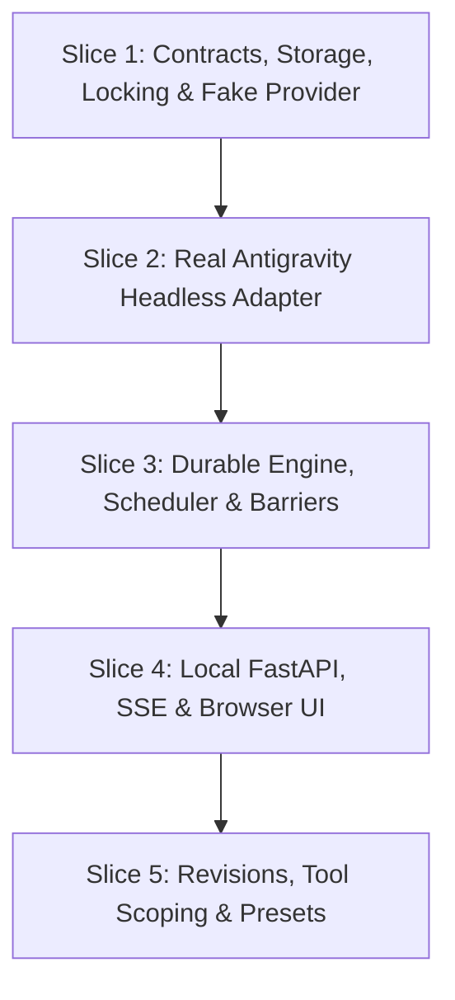

# AGYM Council Implementation Master Plan

This document serves as the comprehensive engineering master plan for implementing the **AGYM Council** system on top of [agy-manager](file:///home/tiagoliv/agy-manager). It synthesizes all specifications from the blueprint packet (`BLUEPRINT.md`, `CONTRACTS.md`, `ACCEPTANCE.md`, `BUILD_HANDOFF.md`, `SOURCES_AND_REPO_REVIEW.md`, and `examples/`), audit findings of the current codebase (`commit 76bfbb5`), and live runtime checks of the `agy` CLI binary (`v1.2.7`).

---

## 1. Architectural Principles & Non-Negotiable Invariants

1. **Separation of Concerns**:
   - **Account** (auth & quota identity) $\neq$ **Worker** (run-local participant) $\neq$ **AgentTemplate** (reusable persona/instructions) $\neq$ **WorkflowTemplate** (structural pipeline).
   - No hardcoded 4-account or 4-worker cap. Parallelism and team size are fully dynamic and configurable.
2. **Backward Compatibility & Profile Collision Immunity**:
   - Running `agym council` must continue to launch an existing user profile literally named `council`.
   - The council application is launched exclusively via `agym-council` (or `python3 -m agym.council.cli`).
   - The core `agym` package remains **100% zero-dependency**; all new dependencies (`fastapi`, `uvicorn`, `pydantic`, `aiofiles`) live in an optional dependency extra `[council]`.
3. **Physical Release Barriers & Zero Premature Leakage**:
   - Each worker turn runs in an isolated scratch workspace (`AGYM_DATA_HOME/council/runs/{run_id}/workers/{worker_id}/attempts/{attempt_id}/workspace`).
   - Only artifacts from completed stages declared in `input_stages` are staged. Unreleased draft artifacts from early finishers in the same stage are physically inaccessible to peers.
4. **Preservation of Disagreement & Dissent**:
   - Consensus is never synthesized by dropping a dissenting worker's critique.
   - If a critic objects, the synthesizer prompt explicitly mandates: *"Produce the final answer with supporting reasons, limitations, and unresolved disagreement. Do not invent consensus."*
5. **Durable Crash Reconciliation & PID Reuse Safeguards**:
   - State and capacity leases survive application restarts in SQLite.
   - Attempts store both OS `pid` and `process_start_time`. On restart, if the process is missing or its start timestamp has changed, the attempt is marked `UNKNOWN` and the run enters `NEEDS_ATTENTION` (no blind, duplicate execution).
6. **Zero Billable Calls & Fake Provider First**:
   - Full end-to-end engine verification, barriers, retries, and UI tests must pass against a deterministic `FakeProviderAdapter` before testing with real Antigravity accounts.

---

## 2. Technical Traps & Runtime Realities

| Area | Pitfall / Naive Approach | Actual Runtime Reality & Required Fix |
|---|---|---|
| **Headless CLI Invocation** | Calling `cmd = ["agy", "--output-format", "stream-json", "--print", "--conversation", id]` | In Go's flag package used by `agy` 1.2.7, `--print` (`-p`) requires an argument string. Passing flags after without a prompt fails with `flag needs an argument: -print`. Must pass `["--print", request.prompt]` or stream NDJSON via stdin with `["--input-format", "stream-json"]`. |
| **Model Discovery Parsing** | Capturing `agy models` stdout + stderr together | `agy models` writes interactive braille spinner frames (`⠋ Fetching available models...`) to `stderr`, and clean tab-separated lines (`<model_id>\t<Model Display Name>\n`) to `stdout`. The adapter must isolate `stdout` and split lines strictly on `\t`. |
| **Profile File Locking** | Opening `config.lock` with mode `"a"` and calling `msvcrt.locking(..., 1)` on Windows | In mode `"a"`, Python places the file pointer at EOF. Windows locks bytes relative to the current file pointer! If the file is not empty, it locks an offset beyond byte 0, causing race conditions. Open with `"a+"`, call `f.seek(0)`, then lock byte 0. On POSIX, use `fcntl.flock(f.fileno(), fcntl.LOCK_EX)`. |
| **Process Tree Termination** | Passing `start_new_session=True` to `asyncio.create_subprocess_exec` on Windows | `start_new_session` is POSIX-only; it raises `ValueError` on Windows. On Windows, use `creationflags=subprocess.CREATE_NEW_PROCESS_GROUP` and terminate via `subprocess.run(["taskkill", "/F", "/T", "/PID", str(proc.pid)])` or native Win32 Job Objects via `ctypes`. |
| **Authentication Verification** | Inferring login status from `.gemini/` file presence | Prohibited by specification. Auth status is three-tier: (1) profile exists, (2) credential directory check, (3) execute `agy models` under the profile environment. If it succeeds, auth is `ready`; if it fails, auth is `needs_login`. |
| **Headless Auth Broker** | Assuming the browser backend can always open a graphical terminal | In headless environments (WSL2 without X11, SSH, Docker), opening a GUI terminal fails. `POST /api/accounts/{id}/connect` must detect this and return a fallback JSON instructing the user to run `agym setup <profile>` in their shell. |

---

## 3. Implementation Roadmap (5 Vertical Slices)

### Slice 1: Domain Contracts, Profile Locking, SQLite Storage & Fake Provider

- **Cross-Process Profile Locking** (`agym/profiles.py`):
  - Add thread-safe, process-safe re-entrant file lock `_profile_lock(lock_path: Path)`.
  - Wrap mutating methods in `ProfileStore`: `create`, `update_settings`, `set_subscription_date`, and `remove`.
  - Verify zero regressions: existing 104 tests continue to pass.
- **Packaging & Entry Points** (`pyproject.toml`):
  - Add `agym-council = "agym.council.cli:main"` entry point.
  - Define optional dependencies `[project.optional-dependencies] council = ["fastapi", "uvicorn[standard]", "pydantic", "aiofiles"]`.
  - Configure automatic setuptools discovery: `include = ["agym*"]`, and package data for presets and web dist.
- **Domain Models** (`agym/council/models.py`):
  - Pydantic models for `Account`, `AgentTemplate`, `WorkerConfig`, `StageConfig`, `LimitsConfig`, `RunConfig`, `TurnRequest`, `TurnResult`.
  - Schema validations (unique worker IDs, acyclic stage dependencies, input stage references).
- **SQLite Storage & Migrations** (`agym/council/storage.py`):
  - Database file: `AGYM_DATA_HOME/council/council.db`.
  - Enabled WAL mode, foreign keys, and 5000ms busy timeout.
  - Tables: `accounts`, `agent_templates`, `workflow_templates`, `runs`, `stage_instances`, `attempts`, `artifacts`, `events`, `issues`, `idempotency_keys`.
- **Content-Addressed Artifacts** (`agym/council/artifacts.py`):
  - Hashing (`sha256`), relative path resolution, directory-traversal prevention.
- **Provider Interface & Fake Adapter** (`agym/council/providers/`):
  - `ProviderAdapter` ABC with `capabilities`, `check_account`, `discover_models`, `run_turn`, `cancel`, `reconcile`.
  - `FakeProviderAdapter` supporting deterministic section responses, synthetic delay, configurable failure, and dissent injection.

### Slice 2: Official Antigravity Headless Adapter

- **Headless CLI Adapter** (`agym/council/providers/antigravity.py`):
  - Use `agym.launcher.resolve_agy()` and `agym.launcher.build_profile_env()`.
  - Model discovery: execute `agy models` under profile env, split `stdout` on `\t`.
  - Auth check: non-billable CLI probe via `agy models`.
  - Turn execution: construct `["--print", request.prompt]`, `--conversation <id>`, `--model <model>`.
  - NDJSON streaming: parse lines from `proc.stdout`, extract conversation ID, stream progress events.
  - Process tree cleanup: `os.killpg` on POSIX session leader, `taskkill` on Windows process group.

### Slice 3: Durable Staged Engine, Concurrency Scheduler & Crash Recovery

- **Context & Prompt Assembly** (`agym/council/context.py`):
  - Strict hierarchical prompt composition (System & Output Rules $\to$ Goal & Constraints $\to$ Stage Contract $\to$ Worker Assignment $\to$ Released Inputs Manifest).
  - Workspace isolation: physical staging of files from completed input stages into attempt directory.
- **Durable Engine & Barriers** (`agym/council/engine.py`):
  - Sequential stage loop; concurrent worker execution bounded by capacity scheduler.
  - Output validation: verify required JSON sections (`findings`, `evidence_or_assumptions`, `uncertainties`, `next_action`).
  - Atomic release barrier: single SQLite transaction transitions stage to `COMPLETED` and marks artifacts as `released = 1`.
  - Uncompromising failure policy: required worker failure transitions run to `NEEDS_ATTENTION`; synthesis is never forced with missing contributors.
  - Dissent preservation: pass critique outputs into synthesizer; synthesizer prompt explicitly instructs not to invent consensus.
- **Concurrency Scheduler & Leases** (`agym/council/scheduler.py`):
  - Dual lease control: global semaphore and per-account serialization semaphore.
  - SQLite transactional attempt claiming via `BEGIN IMMEDIATE`.
  - Pause lifecycle (`RUNNING` $\to$ `PAUSING` $\to$ `PAUSED`) and stop lifecycle (`CANCELLED`).
- **Crash Recovery** (`agym/council/recovery.py`):
  - Scan SQLite on startup for `CLAIMED`, `DISPATCHED`, or `RUNNING` attempts.
  - Verify OS `pid` and `process_start_time` (e.g. via `/proc/{pid}/stat` on Linux).
  - Mark missing/mismatched processes as `UNKNOWN`, transition run to `NEEDS_ATTENTION`, log issue.

### Slice 4: Local FastAPI, Server-Sent Events & Browser UI

- **Secure API Surface** (`agym/council/api.py`):
  - Loopback-only binding (`127.0.0.1`).
  - Origin / Host header validation and `X-Council-Session` token check.
  - Idempotency middleware via `Idempotency-Key` header on state mutations.
  - REST endpoints for Accounts, Agents, Workflows, Runs, and Artifacts.
  - SSE endpoint `/api/runs/{id}/events` supporting `Last-Event-ID` reconnection.
  - Redacted export endpoint `/api/runs/{id}/export` stripping auth paths and environment tokens.
- **Desktop Auth Broker**:
  - `POST /api/accounts/{id}/connect`: Try launching interactive `agym setup <profile>` via terminal emulator; fallback to returning command string in headless environments.
- **Browser Web Interface** (`web/`):
  - React + TypeScript + Vite single-page application.
  - Views: Accounts, Agent Library, Workflow Designer, Run Launcher, Live Run Dashboard.

### Slice 5: Bounded Revisions, Presets & Packaging

- **Bounded Review/Revise Block**:
  - Finite iteration counter: `iteration <= max_revisions` (e.g. max 2 cycles). Terminate when passed or max count reached.
- **Tool Execution Scoping & Confinement**:
  - Declare whitelist-based tool jobs. Visibly badge runs as "Unrestricted workspace" if enforced sandboxing is unavailable.
- **Presets & Distribution**:
  - Copy validated presets into `agym/council/presets/` (`quick_council.json`, `review_and_revise.json`, `research_and_design.json`).
  - Build web assets with Vite into `agym/council/web_dist/`.
  - Verify wheel build and clean installation with `pip install .[council]`.

---

## 4. Acceptance Testing Matrix

| Category | Test Scenario | Target / Command |
|---|---|---|
| **Base Compatibility** | Base package remains functional with zero extra dependencies installed. | `python3 -m unittest discover tests` (104 tests pass) |
| **Profile Collision** | Profile named `council` launches via `agym council`; app launches via `agym-council`. | `tests/council/test_cli.py` |
| **File Locking** | 10 concurrent threads mutating profile settings without corruption. | `tests/council/test_locking.py` |
| **Stage Barriers** | Early finisher outputs are hidden from peers until all stage workers succeed. | `tests/council/test_engine.py` |
| **Dissent Preservation** | Synthesizer deliverable contains critic's objections without smoothing. | `tests/council/test_engine.py` |
| **Account Serialization** | Two workers assigned to the same account run sequentially, not concurrently. | `tests/council/test_scheduler.py` |
| **Crash Recovery** | Simulated `kill -9` during dispatch reconciles to `UNKNOWN` and `NEEDS_ATTENTION`. | `tests/council/test_recovery.py` |
| **Idempotency** | Repeating `POST /api/runs` with identical `Idempotency-Key` does not duplicate run. | `tests/council/test_api.py` |
| **Process Tree Cleanup** | Cancelling an active attempt terminates the entire child process tree. | `tests/council/test_process.py` |
